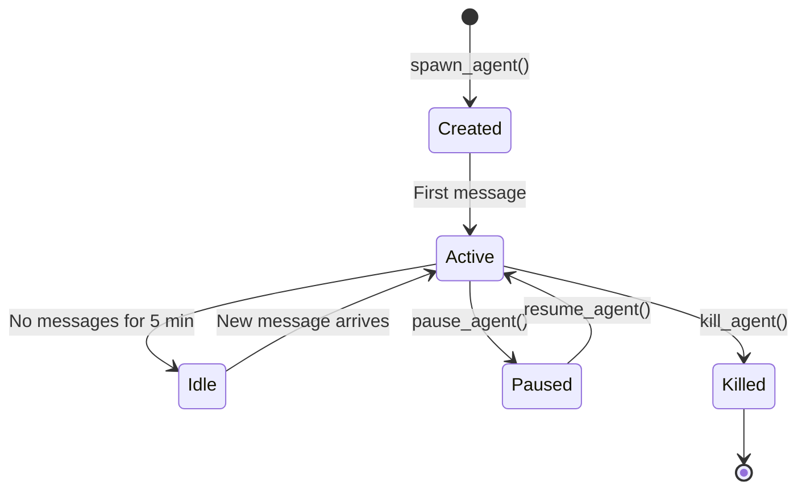

## Overview

In OpenFang, an **agent** is a persistent conversational entity with its own identity, memory, capabilities, and model configuration. Unlike stateless LLM wrappers, OpenFang agents maintain long-running sessions, build knowledge graphs, and can spawn child agents.

<Note>
  Agents are **first-class citizens** in OpenFang. They have IDs, manifests, budgets, permissions, and appear in the kernel's agent registry.
</Note>

## Agent Manifest

Every agent is defined by an `AgentManifest` that declares:

```rust
pub struct AgentManifest {
    pub id: AgentId,                    // Unique identifier
    pub name: String,                   // Human-readable name
    pub description: String,            // What this agent does
    pub module: String,                 // Execution module (builtin:chat, etc.)
    pub provider: String,               // LLM provider (anthropic, openai, etc.)
    pub model: String,                  // Model ID
    pub system_prompt: String,          // Instructions for the LLM
    pub max_tokens: u32,                // Response length limit
    pub temperature: f32,               // Sampling temperature
    pub capabilities: Vec<Capability>,  // Allowed operations
    pub tools: Vec<String>,             // Allowed tool names
    pub created_at: DateTime<Utc>,
    pub metadata: HashMap<String, Value>,
}
```

<Accordion title="Capability-Based Permissions">
  Capabilities define what an agent can do. Examples:
  
  ```rust
  pub enum Capability {
      FileRead,           // Read files from disk
      FileWrite,          // Write files to disk
      ShellExec,          // Execute shell commands
      NetworkAccess,      // Make HTTP requests
      AgentSpawn,         // Spawn child agents
      MemoryAccess,       // Read/write memory
      BrowserControl,     // Drive headless browser
  }
  ```
  
  The kernel checks capabilities before every tool invocation. If an agent tries to use `file_write` without `FileWrite` capability, the call is rejected with an audit trail entry.
</Accordion>

## The Agent Loop

When a user sends a message to an agent, the kernel invokes the **agent loop** — the core execution engine in `openfang-runtime/src/agent_loop.rs`.

<Steps>
  <Step title="Session Retrieval">
    Load the agent's conversation history from the memory substrate. If this is the first message, create a new session.
  </Step>
  
  <Step title="Memory Recall">
    Query the semantic store for relevant past memories using vector similarity search (if embedding driver available) or full-text search.
    
    ```rust
    let memories = memory.recall_with_embedding_async(
        user_message,
        5,  // Top 5 most relevant
        Some(MemoryFilter { agent_id, .. }),
        Some(&query_embedding),
    ).await?;
    ```
  </Step>
  
  <Step title="Prompt Construction">
    Build the final LLM prompt by combining:
    - System prompt from manifest
    - Recalled memories (appended as context)
    - Session message history
    - Tool definitions (if agent has tool-use capability)
    - User's new message
  </Step>
  
  <Step title="LLM Invocation">
    Call the LLM driver (Anthropic, Gemini, or OpenAI-compatible) with the constructed prompt. Stream tokens back as they arrive.
    
    ```rust
    let mut stream = driver.complete(CompletionRequest {
        model: &manifest.model,
        messages: &prompt_messages,
        tools: Some(&available_tools),
        max_tokens: manifest.max_tokens,
        temperature: manifest.temperature,
    }).await?;
    ```
  </Step>
  
  <Step title="Tool Execution">
    If the LLM returns tool calls, execute each one:
    
    - **Capability check**: Verify agent has permission for this tool
    - **Taint check**: Ensure no untrusted data flows into privileged operations
    - **WASM sandbox**: If the tool is a custom skill, run it in the WASM sandbox with fuel metering
    - **Timeout enforcement**: Kill tools that run longer than 120 seconds
    - **Audit logging**: Record every tool invocation in the Merkle hash chain
    
    Return tool results as new messages and loop back to step 4.
  </Step>
  
  <Step title="Iteration Guard">
    The loop runs for up to **50 iterations** (or the agent's `max_iterations` override). This prevents infinite loops and runaway costs.
    
    ```rust
    const MAX_ITERATIONS: u32 = 50;
    
    for iteration in 0..MAX_ITERATIONS {
        // ... LLM call + tool execution
        if stop_reason == StopReason::EndTurn {
            break;
        }
    }
    ```
  </Step>
  
  <Step title="Response Assembly">
    Extract the final text response, apply reply directives (e.g., `[[silent]]`, `[[delay:5s]]`), and return to the kernel.
  </Step>
  
  <Step title="Session Persistence">
    Save the updated message history and usage statistics back to the memory substrate.
  </Step>
</Steps>

<Warning>
  The agent loop is **synchronous per agent** — only one message at a time per agent. This prevents session corruption from concurrent writes. Multiple agents can run in parallel.
</Warning>

## Loop Guards & Safety

OpenFang includes multiple layers of protection against runaway agents:

### Loop Guard (Circuit Breaker)

Detects when an agent is stuck in a tool-call loop:

```rust
pub struct LoopGuardConfig {
    pub max_iterations: u32,           // Hard iteration cap
    pub max_same_tool_streak: u32,     // Same tool N times in a row
    pub max_tool_pair_ping_pong: u32,  // A→B→A→B pattern
}
```

When triggered, the guard injects a system message:

> **LOOP DETECTED**: You have called the same tool 5 times in a row. Consider a different approach or provide a final answer.

### Fuel Metering (WASM Sandbox)

Custom skills run in a WebAssembly sandbox with **dual metering**:

1. **Fuel budget**: Deterministic instruction counting (default: 1,000,000 fuel units)
2. **Epoch interruption**: Wall-clock timeout with watchdog thread (default: 30 seconds)

If either limit is exceeded, the skill is killed with `SandboxError::FuelExhausted`.

### Context Overflow Recovery

If an LLM call fails with `context_length_exceeded`, OpenFang automatically:

1. Trims oldest messages from history
2. Truncates long tool results
3. Compresses memory fragments
4. Retries with reduced context

This happens transparently — users see a brief `[context overflow, recovering...]` notice.

## Agent Lifecycle States



<Accordion title="State Transitions in Code">
  ```rust
  pub enum AgentState {
      Created,    // Spawned but never messaged
      Active,     // Currently processing or recently active
      Idle,       // No activity for 5+ minutes
      Paused,     // User-requested pause
      Killed,     // Permanently stopped
  }
  
  // In kernel
  pub fn pause_agent(&self, agent_id: AgentId) -> Result<()> {
      let mut entry = self.registry.get_mut(&agent_id)?;
      entry.state = AgentState::Paused;
      self.memory.save_agent(&entry)?;
      Ok(())
  }
  ```
</Accordion>

## Agent Hierarchy

Agents can spawn **child agents** if they have the `AgentSpawn` capability:

```
Parent Agent (ID: a1)
  ├── Research Agent (ID: a2, parent: a1)
  ├── Code Review Agent (ID: a3, parent: a1)
  └── Documentation Agent (ID: a4, parent: a1)
```

**Privilege inheritance rules:**

- Child agents inherit a **subset** of parent capabilities (never more)
- Budget limits are shared (child spending counts against parent)
- Killing a parent cascades to all children
- Session memory is isolated (children can't read parent's messages)

<Accordion title="Spawning a Child Agent in Code">
  ```rust
  // In a tool or runtime callback
  let child_manifest = AgentManifest {
      name: "Research Assistant".to_string(),
      parent_id: Some(parent_id),
      capabilities: vec![
          Capability::NetworkAccess,
          Capability::MemoryAccess,
      ],
      ..parent_manifest.clone()
  };
  
  let child_id = kernel.spawn_agent(child_manifest)?;
  ```
</Accordion>

## Scheduling & Cron

Agents can run on schedules using the kernel's cron subsystem:

```rust
pub struct CronEntry {
    pub agent_id: AgentId,
    pub schedule: String,        // Cron expression ("0 9 * * 1-5")
    pub trigger_message: String, // Message to send when triggered
    pub enabled: bool,
}
```

<Steps>
  <Step title="Register Schedule">
    ```bash
    openfang schedule add researcher "0 9 * * 1-5" "Daily market report"
    ```
    
    This creates a cron entry that messages the `researcher` agent every weekday at 9 AM.
  </Step>
  
  <Step title="Background Executor">
    The kernel runs a background task that checks schedules every minute. When a schedule matches, it enqueues a message to the agent.
  </Step>
  
  <Step title="Execution">
    The agent processes the scheduled message through the normal agent loop. The response can be delivered via configured channels (Telegram, email, etc.).
  </Step>
</Steps>

<Note>
  **Hands** (autonomous capability packages) use this scheduling system to run 24/7. The Researcher Hand, for example, might run hourly to monitor competitor websites.
</Note>

## Budget Tracking

Every agent has a token usage and cost budget:

```rust
pub struct AgentBudget {
    pub tokens_used: u64,
    pub cost_usd: f64,
    pub limit_tokens: Option<u64>,    // Hard cap
    pub limit_usd: Option<f64>,       // Hard cap
}
```

After every LLM call, the kernel:

1. Calculates cost using the model catalog pricing
2. Updates the agent's budget
3. Checks if limits are exceeded
4. Optionally triggers alerts or pauses the agent

```bash
# View agent spend
openfang budget agents

# Set a hard limit
openfang budget set-limit researcher --usd 10.00
```

## Observability

The kernel emits structured logs and metrics for every agent operation:

```rust
info!(
    agent = %manifest.name,
    agent_id = %agent_id,
    iteration = iteration,
    tokens = usage.total_tokens,
    "Agent loop iteration complete"
);
```

**Audit trail** records:

- Every agent spawn/kill
- Every tool invocation
- Every capability check (pass/fail)
- Every memory access

Query the audit log:

```bash
curl http://localhost:4200/api/audit/recent?agent_id=<id>
```

## Next Steps

<CardGroup cols={2}>
  <Card title="Hands System" icon="hand" href="/concepts/hands">
    Learn about autonomous agents that run on schedules
  </Card>
  
  <Card title="Memory Substrate" icon="database" href="/concepts/memory">
    Explore how agents store and recall information
  </Card>
  
  <Card title="Security" icon="shield" href="/concepts/security">
    Understand capability checks and sandboxing
  </Card>
  
  <Card title="API Reference" icon="code" href="/api/agents">
    Full API docs for agent management
  </Card>
</CardGroup>
