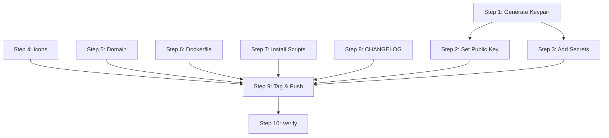

Everything that must be done before tagging `v0.1.0` and shipping to users. Items are ordered by dependency — complete them top to bottom.

## Prerequisites Checklist

<Warning>
Without the Tauri signing keypair, auto-updater is dead. No user will ever receive an update.
</Warning>

### 1. Generate Tauri Signing Keypair

**Status:** 🔴 BLOCKING

The Tauri updater requires an Ed25519 keypair. The private key signs every release bundle, and the public key is embedded in the app binary to verify updates.

<Steps>
  <Step title="Install Tauri CLI">
    ```bash
    cargo install tauri-cli --locked
    ```
  </Step>
  
  <Step title="Generate the keypair">
    ```bash
    cargo tauri signer generate -w ~/.tauri/openfang.key
    ```
    
    Output:
    ```
    Your public key was generated successfully:
    dW50cnVzdGVkIGNvb...  <-- COPY THIS
    
    Your private key was saved to: ~/.tauri/openfang.key
    ```
  </Step>
  
  <Step title="Save both values">
    You need them for steps 2 and 3.
  </Step>
</Steps>

### 2. Set the Public Key in tauri.conf.json

**Status:** 🔴 BLOCKING

Open `crates/openfang-desktop/tauri.conf.json` and replace:

```json
"pubkey": "PLACEHOLDER_REPLACE_WITH_GENERATED_PUBKEY"
```

with the actual public key string from step 1:

```json
"pubkey": "dW50cnVzdGVkIGNvb..."
```

### 3. Add GitHub Repository Secrets

**Status:** 🔴 BLOCKING

Go to **GitHub repo → Settings → Secrets and variables → Actions → New repository secret**:

| Secret Name | Value | Required |
|---|---|---|
| `TAURI_SIGNING_PRIVATE_KEY` | Contents of `~/.tauri/openfang.key` | ✅ Yes |
| `TAURI_SIGNING_PRIVATE_KEY_PASSWORD` | Password set during keygen (or empty string) | ✅ Yes |

#### Optional: macOS Code Signing

<Note>
Without these, macOS users will see "app from unidentified developer" warnings. Requires an Apple Developer account ($99/year).
</Note>

| Secret Name | Value |
|---|---|
| `APPLE_CERTIFICATE` | Base64-encoded `.p12` certificate file |
| `APPLE_CERTIFICATE_PASSWORD` | Password for the .p12 file |
| `APPLE_SIGNING_IDENTITY` | e.g. `Developer ID Application: Your Name (TEAMID)` |
| `APPLE_ID` | Your Apple ID email |
| `APPLE_PASSWORD` | App-specific password from appleid.apple.com |
| `APPLE_TEAM_ID` | Your 10-character Team ID |

To generate the base64 certificate:
```bash
base64 -i Certificates.p12 | pbcopy
```

#### Optional: Windows Code Signing

<Note>
Without this, Windows SmartScreen may warn users. Requires an EV code signing certificate.
</Note>

Set `certificateThumbprint` in `tauri.conf.json` under `bundle.windows` and add the certificate to the Windows runner in CI.

### 4. Create Icon Assets

**Status:** 🟡 VERIFY

The following icon files must exist in `crates/openfang-desktop/icons/`:

| File | Size | Usage |
|---|---|---|
| `icon.png` | 1024x1024 | Source icon, macOS .icns generation |
| `icon.ico` | multi-size | Windows taskbar, installer |
| `32x32.png` | 32x32 | System tray, small contexts |
| `128x128.png` | 128x128 | Application lists |
| `128x128@2x.png` | 256x256 | HiDPI/Retina displays |

Verify they are real branded icons (not Tauri defaults). Generate from a single source SVG:

```bash
# Using ImageMagick
convert icon.svg -resize 1024x1024 icon.png
convert icon.svg -resize 32x32 32x32.png
convert icon.svg -resize 128x128 128x128.png
convert icon.svg -resize 256x256 128x128@2x.png
convert icon.svg -resize 256x256 -define icon:auto-resize=256,128,64,48,32,16 icon.ico
```

### 5. Set Up the openfang.sh Domain

**Status:** 🔴 BLOCKING for install scripts

Users run `curl -sSf https://openfang.sh | sh`.

**Options**:
- **GitHub Pages**: Point `openfang.sh` to a GitHub Pages site that redirects `/` to `scripts/install.sh` from the latest release
- **Cloudflare Workers / Vercel**: Serve the install scripts with proper `Content-Type: text/plain` headers
- **Raw GitHub redirect**: Use `openfang.sh` as a CNAME to `raw.githubusercontent.com/RightNow-AI/openfang/main/scripts/install.sh` (less reliable)

The install scripts reference:
- `https://openfang.sh` → serves `scripts/install.sh`
- `https://openfang.sh/install.ps1` → serves `scripts/install.ps1`

Until the domain is set up, users can install via:
```bash
curl -sSf https://raw.githubusercontent.com/RightNow-AI/openfang/main/scripts/install.sh | sh
```

### 6. Verify Dockerfile Builds

**Status:** 🟡 VERIFY

```bash
docker build -t openfang:local .
docker run --rm openfang:local --version
docker run --rm -p 4200:4200 -v openfang-data:/data openfang:local start
```

<Steps>
  <Step title="Binary runs and prints version">
    ✅ Confirmed
  </Step>
  <Step title="start command boots the kernel and API server">
    ✅ Confirmed
  </Step>
  <Step title="Port 4200 is accessible">
    ✅ Confirmed
  </Step>
  <Step title="/data volume persists between container restarts">
    ✅ Confirmed
  </Step>
</Steps>

### 7. Verify Install Scripts Locally

**Status:** 🟡 VERIFY before release

#### Linux/macOS
```bash
# Test against a real GitHub release (after first tag)
bash scripts/install.sh

# Or test syntax only
bash -n scripts/install.sh
shellcheck scripts/install.sh
```

#### Windows (PowerShell)
```powershell
# Test against a real GitHub release (after first tag)
powershell -ExecutionPolicy Bypass -File scripts/install.ps1

# Or syntax check only
pwsh -NoProfile -Command "Get-Content scripts/install.ps1 | Out-Null"
```

#### Docker smoke test
```bash
docker build -f scripts/docker/install-smoke.Dockerfile .
```

### 8. Write CHANGELOG.md for v0.1.0

**Status:** 🟡 VERIFY

The release workflow includes a link to `CHANGELOG.md` in every GitHub release body. Ensure it exists at the repo root and covers:

<CardGroup cols={2}>
  <Card icon="cube">
    **Core Features**
    
    - All 14 crates and their purposes
    - 30 agent templates across 4 tiers
  </Card>
  
  <Card icon="plug">
    **Integrations**
    
    - 40 channels
    - 60 skills
    - 20 providers
    - 51 models
  </Card>
  
  <Card icon="shield">
    **Security**
    
    - 9 SOTA security systems
    - 7 critical fixes
  </Card>
  
  <Card icon="desktop">
    **Desktop App**
    
    - Native app with auto-updater
    - System tray integration
  </Card>
  
  <Card icon="right-left">
    **Migration**
    
    - Migration path from OpenClaw
  </Card>
  
  <Card icon="box">
    **Deployment**
    
    - Docker and CLI install options
  </Card>
</CardGroup>

## Release Process

Once steps 1-8 are complete:

### 9. First Release — Tag and Push

<Steps>
  <Step title="Ensure version matches everywhere">
    ```bash
    grep '"version"' crates/openfang-desktop/tauri.conf.json
    grep '^version' Cargo.toml
    ```
  </Step>
  
  <Step title="Commit any final changes">
    ```bash
    git add -A
    git commit -m "chore: prepare v0.1.0 release"
    ```
  </Step>
  
  <Step title="Tag and push">
    ```bash
    git tag v0.1.0
    git push origin main --tags
    ```
  </Step>
</Steps>

This triggers the release workflow which:

1. Builds desktop installers for 4 targets (Linux, macOS x86, macOS ARM, Windows)
2. Generates signed `latest.json` for the auto-updater
3. Builds CLI binaries for 5 targets
4. Builds and pushes multi-arch Docker image
5. Creates a GitHub Release with all artifacts

## Post-Release Verification

After the release workflow completes (~15-30 min):

### GitHub Release Page

<CardGroup cols={2}>
  <Card icon="windows" title="Windows Desktop">
    - [ ] `.msi` present
    - [ ] `.exe` present
  </Card>
  
  <Card icon="apple" title="macOS Desktop">
    - [ ] `.dmg` present
  </Card>
  
  <Card icon="linux" title="Linux Desktop">
    - [ ] `.AppImage` present
    - [ ] `.deb` present
  </Card>
  
  <Card icon="file-code" title="Auto-Updater">
    - [ ] `latest.json` present
  </Card>
  
  <Card icon="terminal" title="CLI Binaries">
    - [ ] `.tar.gz` archives (5 targets)
    - [ ] `.zip` (Windows)
    - [ ] SHA256 checksums
  </Card>
</CardGroup>

### Auto-Updater Manifest

Visit: `https://github.com/RightNow-AI/openfang/releases/latest/download/latest.json`

- [ ] JSON is valid
- [ ] Contains `signature` fields (not empty strings)
- [ ] Contains download URLs for all platforms
- [ ] Version matches the tag

### Docker Image

```bash
docker pull ghcr.io/RightNow-AI/openfang:latest
docker pull ghcr.io/RightNow-AI/openfang:0.1.0

# Verify both architectures
docker run --rm ghcr.io/RightNow-AI/openfang:latest --version
```

### Desktop App Auto-Update (test with v0.1.1)

<Steps>
  <Step title="Install v0.1.0 from the release">
    Download and install the desktop app.
  </Step>
  
  <Step title="Tag v0.1.1 and push">
    Create a minor version bump to test the updater.
  </Step>
  
  <Step title="Wait for release workflow">
    Wait for the release workflow to complete.
  </Step>
  
  <Step title="Open the v0.1.0 app">
    After 10 seconds it should:
    - Show "OpenFang Updating..." notification
    - Download and install v0.1.1
    - Restart automatically to v0.1.1
  </Step>
  
  <Step title="Verify update">
    Right-click tray → "Check for Updates" → should show "Up to Date"
  </Step>
</Steps>

### Install Scripts

```bash
# Linux/macOS
curl -sSf https://openfang.sh | sh
openfang --version  # Should print v0.1.0

# Windows PowerShell
irm https://openfang.sh/install.ps1 | iex
openfang --version
```

## Dependency Flow



Steps 4-8 can be done in parallel. Steps 1-3 are sequential and must be done first.

## Next Steps

<CardGroup cols={2}>
  <Card title="Desktop App" icon="desktop" href="/guides/desktop-app">
    Learn about the desktop app architecture
  </Card>
  
  <Card title="API Reference" icon="code" href="/api/overview">
    Explore the REST API documentation
  </Card>
</CardGroup>
